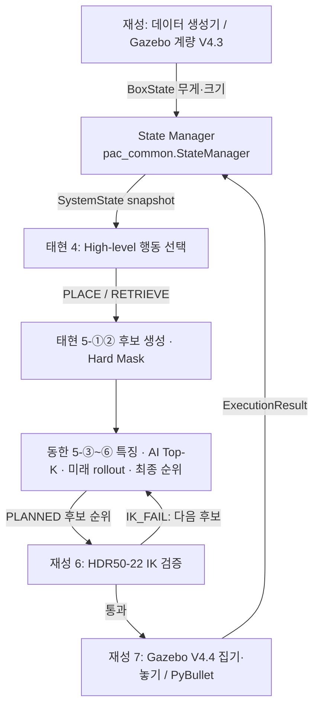

# PAC 2026 · HD현대로보틱스 미션 1 — AHEAD Mixed Palletizing (팀 통합 저장소)

동한·태현·재성 세 사람의 작업을 **하나의 모노레포**로 합친 저장소입니다.
기존 공유 저장소 `yang8988/pac-mission1-shared`의 모든 브랜치와 `dlwotjd1289-cloud/pac2026-ahead`를
**커밋 이력째로** 병합했고, 공통 기준 [v0.3](docs/common_development_standard.md)에 맞게 정리했습니다.

- 목표 로봇: **HDR50-22** (2026-10-08 결정)
- 팔레트: **1.10 × 1.10 m**, 데크 0.15 m, **데크 위 적재 1.5 m**, 총중량 1000 kg → [`config/default.yaml`](config/default.yaml) 한 곳에서만 변경
- 환경: Ubuntu 22.04 · ROS 2 Humble · Python 3.10

## 전체 흐름과 담당



| 파트 | 담당 | 코드 | 문서 |
|---|---|---|---|
| 공통 자료형·State Manager·공통 설정 | 공통 | `ros2_ws/src/pac_common` | [기준서 v0.3](docs/common_development_standard.md) |
| 4 High-level (Rule/PPO) | 태현 | `ros2_ws/src/pac_highlevel`, `tools/highlevel` | [docs/taehyeon/highlevel.md](docs/taehyeon/highlevel.md) |
| 5-①② 후보 생성·Hard Mask, 가상데이터 | 태현 | `ros2_ws/src/pac_candidates`, `tools/virtual_data` | [docs/taehyeon/README.md](docs/taehyeon/README.md) |
| 5-③~⑥ 배치 평가·순위, ROS 서비스 | 동한 | `ros2_ws/src/pac_planning`, `pac_planning_interfaces` | [docs/donghan/README.md](docs/donghan/README.md), [integration.md](docs/donghan/integration.md) |
| 데이터 생성기 | 재성 | `tools/ahead_dataset_generator` | [README](tools/ahead_dataset_generator/README.md) |
| PyBullet 팔레트 시뮬레이터·뷰어 | 재성 | `ros2_ws/src/pac_simulation/pac_simulation/ahead_sim`, `viewer/` | [docs/jaesung/README_AHEAD_LIVE_SIMULATOR.md](docs/jaesung/README_AHEAD_LIVE_SIMULATOR.md) |
| Gazebo 작업셀 V3~V4.4, 로봇·계량 | 재성 | `pac_simulation/worlds`, `pac_bringup`, `pac_robot`, `scripts/*v43*`/`*v44*` | [README_WORKCELL](docs/jaesung/README_WORKCELL.md), [V4.3](docs/jaesung/README_V43.md), [V4.4](docs/jaesung/README_V44.md) |
| V4.5 통합 (계량 → 플래너 → 로봇) | 재성 | `scripts/*v45*` | 아래 "V4.5" |

## 설치와 테스트

```bash
git clone --recurse-submodules https://github.com/dlwotjd1289-cloud/dlwotjd1289-cloud.git pac2026
cd pac2026
python3 -m pytest -q                                 # 설치 없이 바로: 307 passed, 2 skipped (torch/gymnasium 없을 때)

# 패키지 설치가 필요하면 venv 사용 (Ubuntu 22.04 시스템 pip 22.0은 pyproject를 읽지 못해 UNKNOWN 패키지가 됨)
python3 -m venv .venv && . .venv/bin/activate
pip install -e '.[dev,sim]'                          # 강화학습까지: '.[dev,sim,rl]'
```

테스트는 루트 `conftest.py`가 패키지 경로를 잡아 주므로 설치 없이 돌아갑니다 (필요 패키지: numpy, PyYAML, Shapely, pytest; 물리 테스트는 pybullet·networkx).
venv 안에서 pytest를 돌릴 때 ROS가 source된 셸이면 ROS pytest 플러그인 때문에 실패할 수 있습니다 → `env -u PYTHONPATH python -m pytest -q`.

ROS 2 빌드 (Humble):

```bash
source /opt/ros/humble/setup.bash
cd ros2_ws && colcon build --symlink-install && source install/setup.bash
```

## 자주 쓰는 실행

```bash
# 동한: 플래너 데모 / 팀 연결 재생 (생성기 데이터 → 태현 Rule·후보 → 동한 평가)
python3 -m pac_planning.demo --model models/dual_head_ranker.json --fixed-work
python3 scripts/donghan/run_team_replay.py --dataset runs/v45_dataset --max-boxes 5

# 태현: 가상데이터 생성·검증, 전체 검증 리포트
python3 tools/virtual_data/scripts/generate_virtual_data.py --run-generator sample --sample-per-family 2 --output runs/vd
scripts/taehyeon/run_validation.sh

# 재성: 데이터 생성기 / PyBullet 실시간 시뮬레이터 (브라우저 http://127.0.0.1:4173)
tools/ahead_dataset_generator/run_sample.sh
python3 scripts/run_ahead_simulator.py

# ROS 배치 계획 서비스 (/pac/plan_placement)
ros2 launch pac_planning placement_planner.launch.py \
  candidate_config:=$PWD/config/taehyeon/candidates.yaml planner_config:=$PWD/config/default.yaml use_sim_time:=false
```

## V4.5: 계량 → 팀 플래너 → 로봇 (통합 검증)

| 스크립트 | 역할 |
|---|---|
| `scripts/run_mission_v45.sh` | Gazebo 1박스: V4.3 계량 → 플래너 → HDR50-22 IK 검증·적재 → `ExecutionResult` JSON |
| `scripts/plan_placement_v45.py` | 계량값으로 `SystemState`를 만들고 동한 `plan_request`(서비스와 같은 함수) 호출 |
| `scripts/verify_stack_bullet_v45.py` | 여러 박스: 생성기 도착 순서 → 플래너 → IK → PyBullet → `StateManager` 확정, 반복 |
| `scripts/mission_bridge_v45.py`, `pick_place_plan_v45.py`, `run_mission_v45.py` | 좌표 변환, yaw 회전 경로, ROS 실행 노드 |

```bash
# Gazebo (터미널 1): ros2 launch pac_bringup hdr50_workcell_v4_4_pick.launch.py  → ▶
bash scripts/run_mission_v45.sh
# PyBullet 여러 박스
python3 scripts/verify_stack_bullet_v45.py --scenario S0001 --skip-unplaceable
```

## 이번 통합에서 바꾼 것 (공통 기준 v0.3)

| 항목 | 이전 | 지금 |
|---|---|---|
| 저장소 | 브랜치 4개 + 별도 저장소, 서로 `.deps`/별도 checkout으로 참조 | 모노레포 하나, 같은 이름 패키지 1벌 |
| `pac_common` | 동한본·작업셀본 2벌 (내용 다름) | 동한본을 기준으로 StateManager·config·frames 추가 |
| 의존성 | requirements 3개 + pyproject | 루트 `pyproject.toml` 하나 |
| 팔레트 | 1.2×1.0 / 1.1×1.1, 높이 1.35·1.5·1.6 m 혼재 | `config/default.yaml` 단일 원본 (1.1×1.1, 데크 위 1.5 m) + 일치 검사 테스트 |
| `PalletState.size.z` | 생성기는 목재 두께 0.15 | 데크 위 적재 높이 (생성기 1.3.0) |
| 상태 확정 | 측정 pose 그대로 → 플래너가 거부 | 오차 xy 5 mm·z 3 mm·yaw 1° 이내면 계획 pose 확정 |
| 목표 로봇 | HDP160-31 (HDR50-22는 대용) | HDR50-22 |
| 로봇 명령 | 후보 모서리를 그대로 전달 | 박스 중심으로 변환 (`pac_common.frames`) |
| 0 N 상부 하중 | 시뮬레이터가 거부 | 동한 패치 적용 (적재 불가 박스 표현) |
| ROS 서비스 | 빌드·호출 미검증 | Humble에서 빌드·호출 검증, 종료 오류 수정 |

변경 이유와 검증은 각 커밋 메시지에 있습니다 (`git log`).

## 남은 일 / 팀 확인 필요

1. **공통 기준 v0.3 팀 확인** (기준서 26장): 위 결정을 동한·태현님이 확인
2. **State Manager 운영 담당** 확정 (구현은 `pac_common.StateManager`에 있음)
3. **태현 PPO 정책**은 데크 위 1.35 m 기준으로 학습됨 → 1.5 m 세계에서 재평가·재학습 필요
4. 큰 박스가 늦게 오면 지지면 부족(`LOW_SUPPORT`)으로 놓을 곳이 없음 → High-level 버퍼/NG와 평탄 적재 점수 조정
5. Gazebo V4.4 그리퍼·V4.5 전체 1회 실기 검증, 이후 State Manager 연결 5~10박스 반복
6. `main` 보호 규칙 설정 (기준서 23장: 직접 push 금지, PR + 1명 확인)

## 이력

| 원본 | 커밋 | 위치 |
|---|---|---|
| shared `feature/donghan-placement-planner` | 7860043 | `ros2_ws/src/pac_planning*`, `docs/donghan`, `tests/donghan` |
| shared `claude/pensive-pasteur-dwbu3g` (태현) | e75e274 | `pac_candidates`, `pac_highlevel`, `tools/{virtual_data,highlevel}` |
| shared `feature/jaesung-dataset-generator` | cc4c075 | `tools/ahead_dataset_generator` |
| shared `feature/jaesung-physics-simulator` | 7f4ae37 | `pac_simulation/ahead_sim`, `viewer/` |
| `pac2026-ahead` `fix/hyundai-submodule-init` + 미커밋 V3~V4.5 | 0c8fb80 | 작업셀·로봇·`docs/jaesung`·`tests/workcell` |

**2026-10-09 갱신 (각자 최신본으로 교체)**

| 원본 | 커밋 | 위치 / 비고 |
|---|---|---|
| `yang8988/pac-mission1-taehyeon` main (태현) | 74cbc38 | e75e274 이후 19커밋 이력째 병합: `pac_runtime`, `pac_robot_check`, `tools/{runtime,tuning}` |
| `donghan7298-code/pac2026-ahead-donghan` main (동한 v3) | c0dd992 | 위와 같은 경로 규칙으로 병합: `pac_execution`, `pac_gazebo_grasp`, 학습·평가 파이프라인, 시연 설정. `archive/`(24 MB 기록)는 원본 저장소에만 있음 |
| `pac2026_hdr50_proxy_scaffold` 미커밋 V4.4 (재성) | fa3115a + 작업본 | 카메라 인식, AHEAD 연결, 다중 박스·생성기 사이클, 팔레트 교체(시험 중). `*_v45`는 이미 통합된 최신본 유지 |
| `ahead-dataset-generator` main (재성) | 401f097 | 생성기 v1.4.0 (중복 제거, 무게 분포) |
| 감사·알고리즘 검토 (재성) | — | `docs/jaesung/audit_20261009`, `tools/prototypes` (실험용, 운영 경로 아님) |

`git log --follow <파일>`로 원래 위치의 이력까지 볼 수 있습니다.
