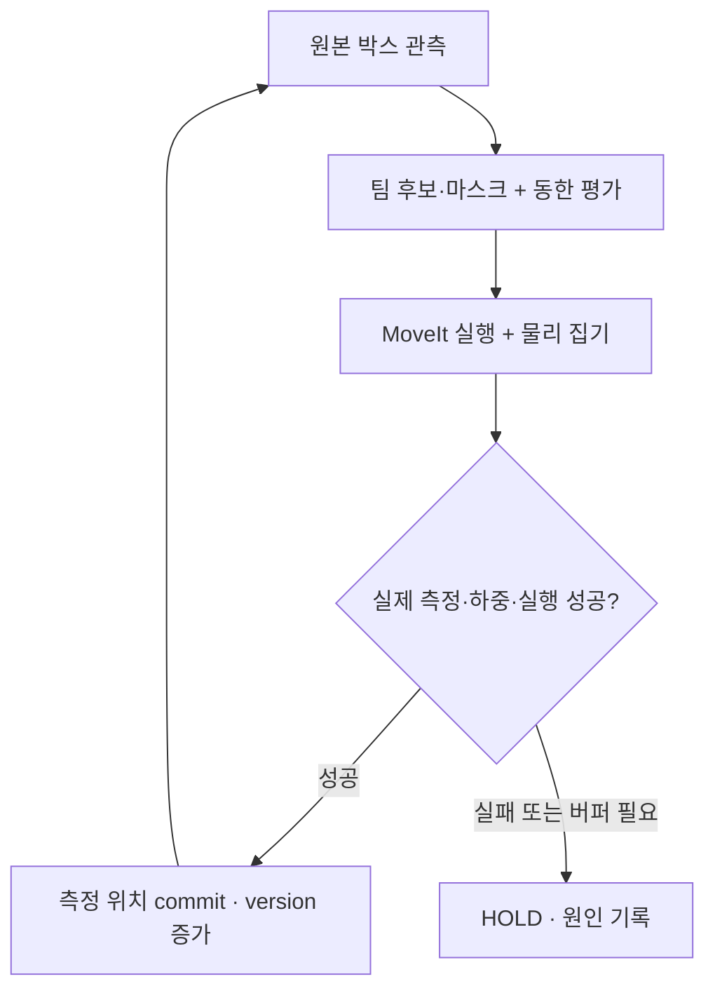

# 원본 박스 시연 v3: 동한 평가기에서 측정 상태 갱신까지
확인일: 2026-10-09. 원격 반영 전 로컬 제공본이다.

이 문서의 ROS 명령은 Ubuntu 22.04 + ROS2 Humble + Gazebo Fortress에서 실행할 절차다.
작성 환경은 Ubuntu 24.04 / Python 3.12로 ROS와 Gazebo가 없다. 새 C++ grasp plugin도
아직 컴파일하지 않았다. 따라서 현재 결과를 ROS 통합 완료 또는 로봇 시연 성공으로 부르지 않는다.

## 실제로 확인한 범위

| 확인 | 결과 | 해석 |
|---|---|---|
| 팀 생성기 원본 크기·무게 | S0001의 처음 6개/8개와 일치 | 크기를 줄인 데모 박스가 아니다 |
| 동한 h3/s7 평가 + 측정 상태 루프 | 원본 6개, solid/slatted 모두 통과 | 매 박스의 실제 Bullet 위치를 CoreBridge에 반영한 뒤 다음 계획 |
| DBLF + 측정 상태 루프 | 원본 8개, solid/slatted 모두 통과 | 첫 로봇 실행의 비교용 기준 |
| 동한 평가 + 원본 8개 | 6개 후 7번째에서 BUFFER_CURRENT로 정지 | 버퍼 actuator가 없는 시연에서 성공 처리하지 않음 |
| 기존 h2/s3 + 원본 8개 | robot-checks 12/64 모두 2개 팔레트/버퍼 경로 | 검사 개수를 늘리는 것만으로 해결되지 않음 |
| 실제 ROS/MoveIt/Gazebo 로봇 | 미실행 | 아래 build → preview → 1개 → 6개 절차가 남음 |
| 카메라·저울 | 미연동 | 원본 SKU·크기·무게를 알려주는 fixture source 사용 |
| 상부 허용하중 | TEAM_MCKEE_ASSUMPTION | 생성기의 실측 박스 강도 데이터가 아니다 |

Bullet 검증은 선택 위치 위 10 mm에서 강체를 투입해 중력으로 정착시키는 검사다.
로봇의 집기/운반, 진공 압력, 골판지 변형은 검사하지 않았다.
고정 layout 정착 검사와, 측정 결과를 매번 runtime에 반영한 루프 검사를 구분한다.

## 무엇을 바꿨고 왜 필요한가

| 파일 | 역할과 변경 이유 |
|---|---|
| ros2_ws/src/pac_execution/launch/original_boxes_demo.launch.py | 같은 HDR50-22+EOAT URDF를 Gazebo·TF·MoveIt에 사용하고 실제 controller를 연결 |
| pac_execution/executor_node.py | MoveGroup 계획 후 ExecuteTrajectory 결과/실제 joint/TCP 피드백 확인. 시간 경과를 성공으로 쓰지 않음 |
| pac_gazebo_grasp/src/confirmed_grasp.cpp | 초기 detached, 실제 fixed-joint attach/release 후 확인. 물리 suction 모델은 아님 |
| pac_execution/grasp_node.py | 한 박스만 잡도록 관리하고 joint 상태 응답을 기다림 |
| pac_execution/source_node.py | 들어오는 stock만 conveyor로 이동. 놓을 위치에 박스를 생성하거나 teleport하지 않음 |
| pac_execution/runtime_node.py | version·box·candidate를 확인하고 실제 측정 성공만 commit. PPO proxy/4칸 계약 유지 |
| pac_execution/contract.py | pallet min-corner ↔ world center 변환, 허용한 미세 측정 오차의 표현 변환 |
| pac_execution/audit.py | 기존 팀 hard mask로 실제 지지·충돌·하중 검증. 0 N을 무제한으로 바꾸지 않음 |
| scripts/donghan/check_closed_loop_physics.py | 다음 박스를 measured state에서 계획하는 실제 Bullet 루프 |
| scripts/donghan/check_execution_trace.py | 실행 순서·trajectory 결과·payload lift·release·runtime ack를 기록에서 검사 |
| scripts/donghan/stage_demo_workspace.py | 같은 이름의 pac_common/pac_planning/pac_simulation이 두 번 들어가는 것을 방지 |

실제 AHEAD collision surface 기준: conveyor 상면 z=0.85 m, pallet 상면 z=0.15 m.
pallet은 1.2 × 1.0 m이고, lower corner world=(0.75,-1.50,0.15) m다.
robot base world=(1.35,0.15,0.50) m, incoming pick center XY=(-0.20,1.20) m다.
기존 EOAT 설정의 0.22 m 대신 xacro의 실제 cup face에서 산출한 flange→contact 0.1525 m를 사용한다.
EOAT 질량 15 kg은 팀 가정이며, 박스+EOAT를 50 kg payload와 비교한다. N과 kg를 혼용하지 않는다.

계획에는 기존 2 mm size tolerance에 1 mm 여유를 더한다.
측정 감사에는 기존 팀 2 mm hard mask를 그대로 사용한다.
yaw/tilt는 1 mrad 이내만 정확한 upright quarter turn 표현으로 바꾼다.
바닥의 수치적 침투는 최대 0.5 mm만 알려진 pallet plane(z=0)에 투영하고 더 깊으면 정지한다.
XY는 측정치를 유지하며 raw center/quaternion을 로그에 남긴다.
이 보완은 실제 확인한 작은 회전과 음수 Z에 의한 검사 실패에서 출발했다.



## Ubuntu에서 준비

Windows PowerShell에서 Ubuntu를 연다.

```powershell
wsl -d Ubuntu-22.04
```

이후 아래 명령은 Ubuntu 터미널에서 실행한다. 새로운 checkout에 ZIP의 패치를 적용한다.
동한 누적 패치는 remote 7860043 기준, 팀 패치는 81d0333 기준이다.
적용 명령은 ZIP의 README_APPLY_KO.md에 있다. main에 merge하지 않는다.

```bash
source /opt/ros/humble/setup.bash
DONGHAN_ROOT=~/AHEAD/pac-donghan/pac-mission1-shared
TEAM_ROOT=~/AHEAD/pac-team
AHEAD_ROOT=~/AHEAD/pac2026-ahead-demo
DEMO_WS=~/AHEAD/demo_ws_v3

git clone --branch fix/hyundai-submodule-init --single-branch \
  https://github.com/dlwotjd1289-cloud/pac2026-ahead.git "$AHEAD_ROOT"
cd "$AHEAD_ROOT"
git rev-parse HEAD
bash scripts/fetch_hyundai_refs.sh
git submodule status --recursive
```

AHEAD fix HEAD는 0c8fb80f5674e6202489209a743f8b82ce915262 기준이다.
기존 AHEAD checkout을 지우거나 local 수정 위로 강제 checkout하지 않는다.
이 fix는 기록된 Hyundai submodule commit을 초기화하는 버전이다.

Humble의 기본 Gazebo 조합인 Fortress를 사용한다.

```bash
sudo apt update
sudo apt install -y python3-pip python3-venv python3-colcon-common-extensions \
  python3-rosdep build-essential \
  ros-humble-moveit ros-humble-ros-gz ros-humble-gz-ros2-control \
  ros-humble-ros2-controllers ros-humble-robot-state-publisher \
  ros-humble-xacro ros-humble-rviz2 \
  libignition-gazebo6-dev libignition-plugin1-dev libignition-transport11-dev
```

ign이 없거나 ignition 개발 패키지를 apt에서 찾지 못하면 공식 Fortress 설치 절차로
해당 배포판 repository를 먼저 구성한다: https://gazebosim.org/docs/fortress/install_ubuntu/
Harmonic을 설치해 같은 plugin과 혼용하지 않는다.

```bash
python3 "$DONGHAN_ROOT/scripts/donghan/stage_demo_workspace.py" \
  --team-root "$TEAM_ROOT" --ahead-root "$AHEAD_ROOT" --output "$DEMO_WS"
cd "$DEMO_WS"
rosdep update
rosdep install --from-paths src --ignore-src --rosdistro humble -y \
  --skip-keys="ignition-gazebo6 ignition-plugin1 ignition-transport11"
colcon build --symlink-install
source install/setup.bash
python3 "$DONGHAN_ROOT/scripts/donghan/robot_preflight.py" \
  --workspace "$DEMO_WS" --output "$DONGHAN_ROOT/reports/robot_preflight_local.json"
```

skip-keys의 세 ignition library는 바로 앞 apt 명령으로 설치한 경우에만 제외한다.
workspace에는 14개 package와 동한 pac_common/pac_planning 한 벌이 있어야 한다.
동일 이름의 shared Bullet pac_simulation은 이 workspace에 넣지 않는다.
AHEAD의 pac_simulation은 world/EOAT asset을 제공하는 package다.

정상 build는 pac_gazebo_grasp를 포함한 14개 package가 완료되고 preflight PASS가 나온다.
이 PASS는 환경 준비 검사이며 로봇 동작 성공을 뜻하지 않는다.
C++ 오류, 누락한 mesh, ROS schema 차이가 발생하면 build 로그를 먼저 보존한다.

## preview → 단일 박스 → 원본 6개

새 terminal마다 /opt/ros/humble/setup.bash와 demo workspace install/setup.bash를 source한다.
옛 runtime/gazebo_driver와 이 launch를 동시에 띄우지 않는다.
학습용 .venv-model을 켰다면 먼저 deactivate하고 ROS를 다시 source한다.
Humble의 system Python 3.10과 rclpy를 사용해야 한다.

```bash
ros2 launch pac_execution original_boxes_demo.launch.py \
  planner_root:="$DONGHAN_ROOT" team_root:="$TEAM_ROOT" \
  demo_dir:="$DONGHAN_ROOT/config/demo_original6" \
  ranker:=donghan ranker_config:="$DONGHAN_ROOT/config/model_14400_firstpass.yaml" \
  execute_enabled:=false
```

preview는 실제 controller/TF 준비와 stock detached 응답을 확인하며 박스 입력을 시작하지 않는다.
RViz에서 Fixed Frame을 world로 지정하고 RobotModel/PlanningScene을 추가해 본다.

다른 Ubuntu terminal에서 아래를 확인한다.

```bash
ros2 control list_controllers
ros2 action list
ros2 topic echo /pac/executor_ready --once
python3 "$DONGHAN_ROOT/scripts/donghan/robot_preflight.py" \
  --workspace "$DEMO_WS" --live --output "$DONGHAN_ROOT/reports/robot_preflight_live.json"
```

joint_state_broadcaster와 joint_trajectory_controller가 active여야 하고,
/move_action, /execute_trajectory, /pac/gazebo_world_poses가 있어야 한다.
ROS graph 준비만으로 motion planning/실제 집기가 성공한 것은 아니다.

먼저 원본 1개 fixture를 만들고 기존 Gazebo를 종료한 뒤 별도 실행한다.
SOURCE_DATASET은 ZIP의 experiments/source_dataset 또는 생성한 180/14400 dataset 경로다.

```bash
SOURCE_DATASET=~/Downloads/PAC2026_Donghan_v3_20261009/experiments/source_dataset
python3 "$DONGHAN_ROOT/scripts/donghan/prepare_robot_demo.py" \
  --team-root "$TEAM_ROOT" --dataset "$SOURCE_DATASET" --boxes 1 \
  --output "$DONGHAN_ROOT/config/demo_original1"
ros2 launch pac_execution original_boxes_demo.launch.py \
  planner_root:="$DONGHAN_ROOT" team_root:="$TEAM_ROOT" \
  demo_dir:="$DONGHAN_ROOT/config/demo_original1" \
  ranker:=donghan execute_enabled:=true
```

단일 박스에서 PRE_GRASP → DESCEND_GRASP → attach → LIFT → PRE_PLACE →
DESCEND_PLACE → release → RETREAT가 실제로 보여야 한다.
arm만 움직이면 실패다. payload의 실제 상승 위치, joint attach/release,
놓은 후 box world pose, runtime placed=1/version 증가를 모두 검사한다.

단일 박스를 종료한 뒤 6개 fixture를 execute_enabled:=true로 새로 실행한다.
측정 하드마스크 실패, 오래된 box 이동, unsupported action은 HOLD로 남고 자동 완료되지 않는다.

```bash
ros2 launch pac_execution original_boxes_demo.launch.py \
  planner_root:="$DONGHAN_ROOT" team_root:="$TEAM_ROOT" \
  demo_dir:="$DONGHAN_ROOT/config/demo_original6" \
  ranker:=donghan ranker_config:="$DONGHAN_ROOT/config/model_14400_firstpass.yaml" \
  execute_enabled:=true

python3 "$DONGHAN_ROOT/scripts/donghan/check_execution_trace.py" \
  --demo-dir "$DONGHAN_ROOT/config/demo_original6" \
  --output "$DONGHAN_ROOT/reports/robot_acceptance_local.json"
```

trace 검사 명령은 launch가 진행되는 도중이 아니라 demo_complete 이후 별도 terminal에서 실행한다.
정상 결과는 RECORDED_ACCEPTANCE / boxes=6이다. 실제 기록이 없으면 INCOMPLETE다.
이 검사도 기록 분석이며 물리의 독립적인 재실험은 아니다.
비교용 8개는 demo_original8, ranker:=dblf로 실행한다.

## 학습 모델 연결의 남은 조건

현재 14,400-box 학습은 원래 팀 2 mm 후보 설정과 0.22 m robot checker 계약으로 진행 중이다.
이 시연은 3 mm 후보 여유와 0.1525 m 실제 cup offset을 사용한다.
또한 candidate backend 최적화로 source hash가 바뀌었으므로 이전 v2 모델도
그대로 호환된다고 볼 수 없다. 모델 검사를 건너뛰거나 학습 파일의 hash를 덮어쓰지 않는다.

시연 계약으로 학습하려면 새로운 output에 명시적으로 실행한다.

```bash
cd "$DONGHAN_ROOT"
OPENBLAS_NUM_THREADS=1 OMP_NUM_THREADS=1 \
python3 scripts/donghan/model_pipeline.py all \
  --team-root "$TEAM_ROOT" --team-ref 81d0333ba6550d9ee6f02661d8b8d9e79beaca6c \
  --generator-ref cc4c075daa3dd4c7f80510042732763fc9502933 \
  --dataset "$SOURCE_DATASET" --config config/model_14400_firstpass.yaml \
  --candidate-config config/demo_original6/candidates_demo.yaml \
  --robot-config config/demo_original6/robot_check_demo.yaml \
  --output experiments/demo_contract_v3 --resume
```

이 재학습 명령은 아직 실행하지 않았다. 기존 14,400 학습 output을 재사용하지 않는다.
validation 선택과 held-out runtime 비교에서 baseline보다 개선되었는지 확인한 뒤
호환된 selected_model.json을 launch의 model_path로 명시한다.
첫 로봇 실행은 model_path를 비워 두고 동한 weighted score/look-ahead를 사용한다.
PPO를 재학습하거나 value_provider를 임의로 교체하지 않는다.

버퍼 rack은 실제 SDF의 solid envelope여서 슬롯 pose만 정하면 들어갈 수 있는 구조가 아니다.
버퍼 physical collision/slot pose/pick-place/확인 응답, 팔레트 교체, NG 처리, repack은
담당자와 실제 actuator 계약을 추가해야 한다. 현재 HOLD를 성공으로 바꾸면 안 된다.

## 로봇 실행 전 Bullet 루프 재현

배포본 physics_reference는 shared 물리 7f4ae37의 Python source와 두 파일의 0 N 보완이다.
Gazebo용 workspace에는 넣지 않는다. 아래 명령은 모델용 venv에 pybullet/networkx를
설치한 뒤 실행하는 별도 검사이며 ROS나 로봇을 시작하지 않는다.

```bash
cd "$DONGHAN_ROOT"
AHEAD_V3_BUNDLE=~/Downloads/PAC2026_Donghan_v3_20261009
python3 scripts/donghan/check_closed_loop_physics.py \
  --team-root "$TEAM_ROOT" --physics-package "$AHEAD_V3_BUNDLE/physics_reference" \
  --demo-dir config/demo_original6 --ranker donghan \
  --ranker-config config/model_14400_firstpass.yaml --deck solid \
  --output reports/original6_closed_loop_local.json
```

정상 결과는 PASS_MEASURED_LOOP, measured_and_committed=6이다.
slatted를 검사하려면 --deck slatted와 별도 output을 지정한다.
DBLF 비교는 demo_original8 / --ranker dblf로 바꾼다.
이 검사에서 임의로 측정값을 target pose로 대체하지 않는다.
