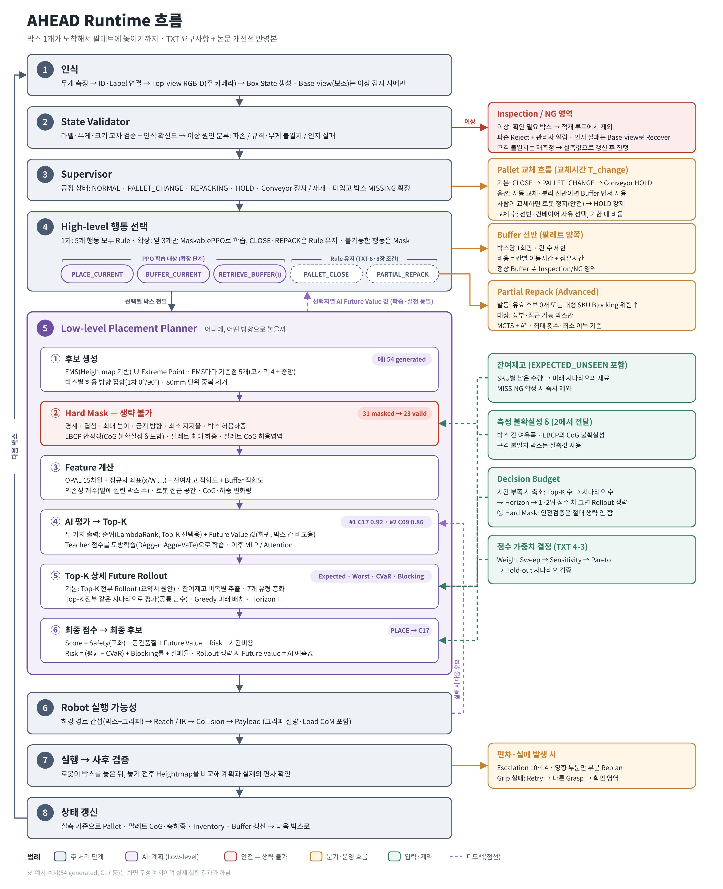

# AHEAD Runtime 흐름별 코드 안내

박스 1개가 도착해서 팔레트에 놓이기까지의 흐름(아래 그림)을 기준으로 **각 단계가 저장소의 어디에 구현되어 있는지** 정리한 안내입니다. 코드는 담당자별 위치에 그대로 있고, 이 문서는 흐름 순서로 찾아가는 지도입니다.



## 단계 → 코드

| 단계 | 핵심 코드 | 담당 | 문서 |
|---|---|---|---|
| 1 인식 | `ros2_ws/src/pac_runtime/pac_runtime/perception.py` (가상), `scripts/scale_cycle_core_v43.py`·`scripts/box_perception_v44.py` (Gazebo) | 태현 / 재성 | [01](01_perception.md) |
| 2 State Validator | `ros2_ws/src/pac_runtime/pac_runtime/state_validator.py` | 태현 | [02](02_state_validator.md) |
| 3 Supervisor | `ros2_ws/src/pac_runtime/pac_runtime/supervisor.py` | 태현 | [03](03_supervisor.md) |
| 4 High-level 행동 | `ros2_ws/src/pac_highlevel/` (Rule / Look-ahead / 재적재; PPO 미사용) | 태현 | [04](04_highlevel.md) |
| 5 ①② 후보 생성·Hard Mask | `ros2_ws/src/pac_candidates/` | 태현 | [05](05_lowlevel_planner.md) |
| 5 ③~⑥ Feature·AI Top-K·Rollout·최종 점수 | `ros2_ws/src/pac_planning/` | 동한 | [05](05_lowlevel_planner.md) |
| 6 Robot 실행 가능성 | `ros2_ws/src/pac_robot_check/` | 태현 | [06](06_robot_feasibility.md) |
| 7 실행 → 사후 검증 | `pac_runtime` executor (가상), `scripts/*_v44/v45` (Gazebo + MoveIt 흡착) | 태현 / 재성 | [07](07_execution.md) |
| 8 상태 갱신 | `ros2_ws/src/pac_common/pac_common/state_manager.py` | 공통 | [08](08_state_update.md) |
| 곁가지 흐름 | NG, 팔레트 교체, 버퍼, 재적재, 잔여재고, δ, 시간 예산, 가중치 결정 | — | [09](09_side_flows.md) |
| 실행 진입점 | ROS 노드, launch, 실행 스크립트 | — | [10](10_entry_points.md) |
| **알려진 문제** | 남은 미구현, 정리 내역 | — | [KNOWN_ISSUES](KNOWN_ISSUES.md) |
| **결정사항 충돌 검토** | 최종 결정 대비 충돌과 처리, 팀 확인 필요 항목 | — | [DECISION_REVIEW](DECISION_REVIEW.md) |
| **구현 간 충돌 검토** | 같은 일을 다른 규칙·값으로 하는 코드 (재성 Gazebo·v3 ↔ 팀 런타임). C1~C35, 3차는 미병합 브랜치(V4.6, ranker-fix) 포함·동한 overlap review 대조 | — | [IMPLEMENTATION_CONFLICTS](IMPLEMENTATION_CONFLICTS.md) |

## 전체 구조: 판단 코어 1개 + 실행 환경

```
                ┌─────────────── RuntimeCore (pac_runtime/core.py, 태현) ───────────────┐
                │ 1 인식 → 2 검증 → 3 Supervisor → 4 pac_highlevel → 5 pac_candidates   │
                │                                   (+ pac_planning 순위, 선택)          │
                │ → 6 pac_robot_check → 명령 → 7 결과 검증 → 8 pac_common.StateManager  │
                └───────────────────────────────────────────────────────────────────────┘
   실행 환경:  ① 가상 셀  pac_runtime/loop.py (PerceptionSim, ExecutorSim)          — 오프라인
               ② Gazebo V4.4 (재성)  scripts/*_v44/v45 — 계량 → 5·6단계 → MoveIt 흡착 → 8단계
                  같은 팀 함수(plan_request, RobotFeasibility, StateManager)를 직접 호출
               ③ PyBullet 폐루프  scripts/verify_stack_bullet_v45.py, tools/runtime/scripts/physics_replay.py
```

## 담당자별 폴더 (원래 위치)
| 담당 | 위치 |
|---|---|
| 태현 | `pac_candidates`, `pac_highlevel`, `pac_runtime`, `pac_robot_check`, `tools/{virtual_data,highlevel,runtime,tuning}`, `config/taehyeon`, `docs/taehyeon`, `tests/taehyeon` |
| 동한 | `pac_planning`, `pac_planning_interfaces`, `pac_perception` 깊이·SKU 추정, `pac_reinspection`, `scripts/donghan`, `config/donghan`, `docs/donghan`, `tests/donghan` |
| 재성 | `pac_perception` 관측 생성기, `pac_simulation`, `pac_bringup`, `scripts/*_v4*`, `viewer/`, `tools/ahead_dataset_generator`, `tools/prototypes`, `docs/jaesung`, `tests/workcell` |
| 공통 | `pac_common` (자료형, StateManager, frames), `config/default.yaml`, `config/workcell.yaml`, `pyproject.toml`, `conftest.py`, `docker/`, `docs/common_development_standard.md` |

이 안내는 2026-10-09 정리본 기준입니다. 코드가 바뀌면 해당 단계 문서도 함께 고쳐 주세요.
